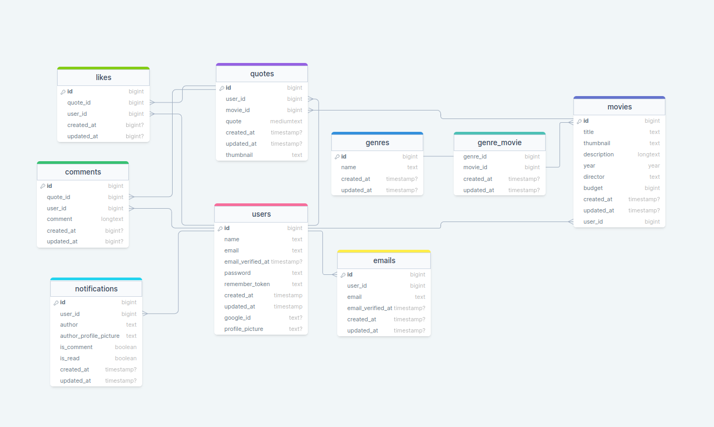

# Epic movies quotes
This repository is created for back-end side of "Epic Movies Quotes" project, where the user can create movies and add famous quotes to them, which will be posted in news feed for other people to see. 


## Table of contents#
* [Features](#features)
* [Tech Stack](#tech-stack)
* [Installation](#installation)
* [Resources](#resources)
* [Database Structure](#database-structure)

## Features
- Localized for Georgian and English languages
- Updating user's credentials
- Enabled live broadcasting
- Commenting to the quotes
- Liking & Unliking the quotes
- Full CRUD on movies
- Full CRUD on quotes
- Live notifications
- Password resets
- Multiple secondary emails table
- Ability to log in from all emails
- Email verifiction
- Google Authorization

## Tech Stack
**Client:** Next, Redux, TypeScript, TailwindCSS, Laravel echo, Pusher

**Server:** Laravel, Sanctum API, Pusher, Spatie Translatable Package, MySQL


## Installation
You can install my project by following instructions:

```bash
    mkdir epic-movies-quotes-back
    cd epic-movies-quotes-back
    git clone https://github.com/RedberryInternship/gigi-epic-movie-quotes-back.git
    composer install
    php artisan migrate --seed
    php artisan serve
```

## Resources
- [Spatie Translatable Package](https://spatie.be/docs/laravel-translatable/v6/introduction)
- [Commit Rules](https://redberry.gitbook.io/resources/kodisa-da-proektis-shepasebis-kriteriumebi/proektisa-da-kodis-khariskhis-zogadi-kriteriumebi)
- [Pusher](https://pusher.com/docs/)

## Database Structure
[Click here to see the diagram](https://drawsql.app/teams/gigi/diagrams/epic-movies-quotes)
